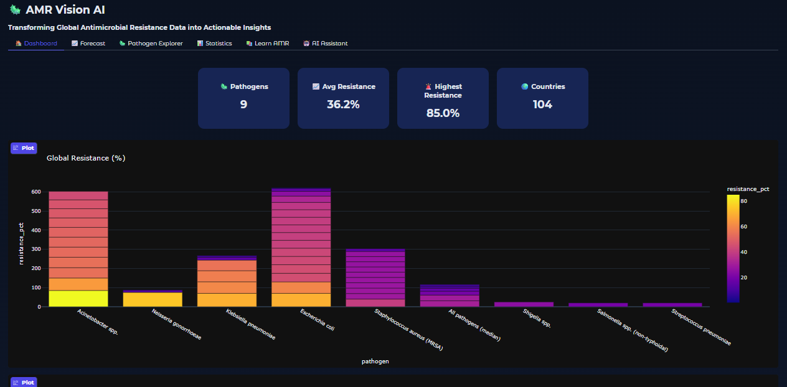
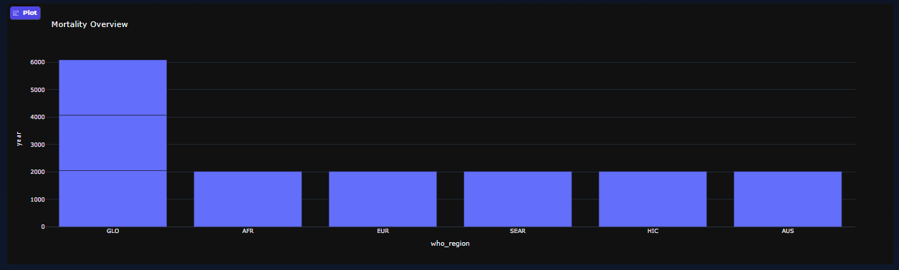
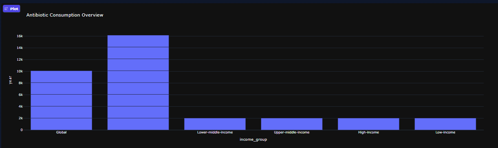
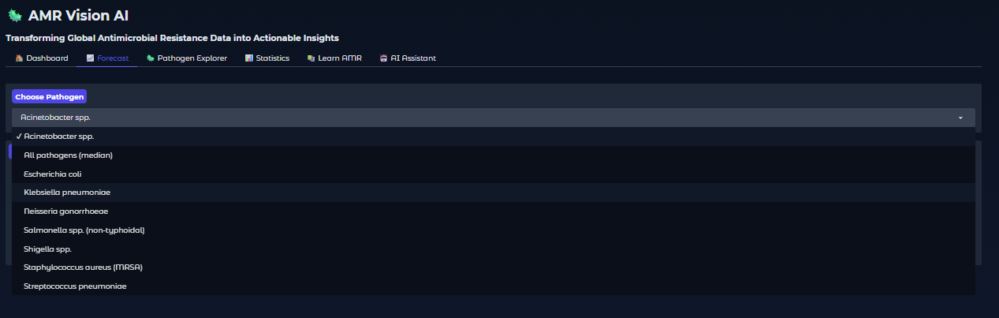
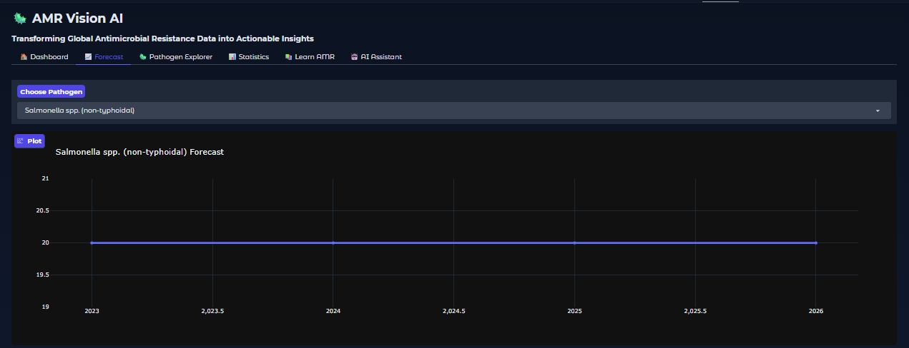
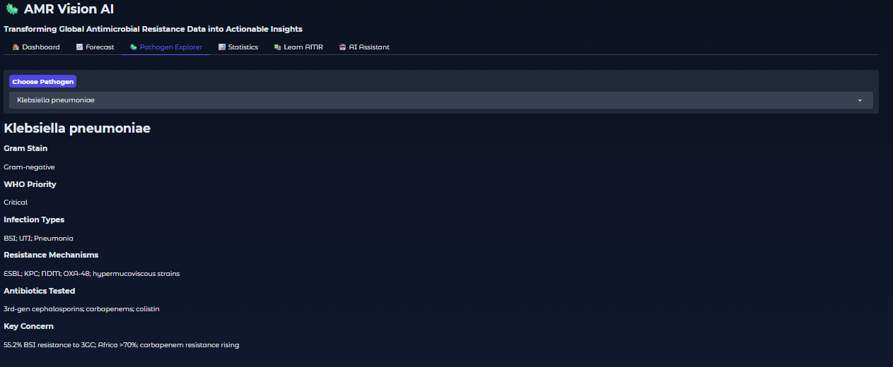
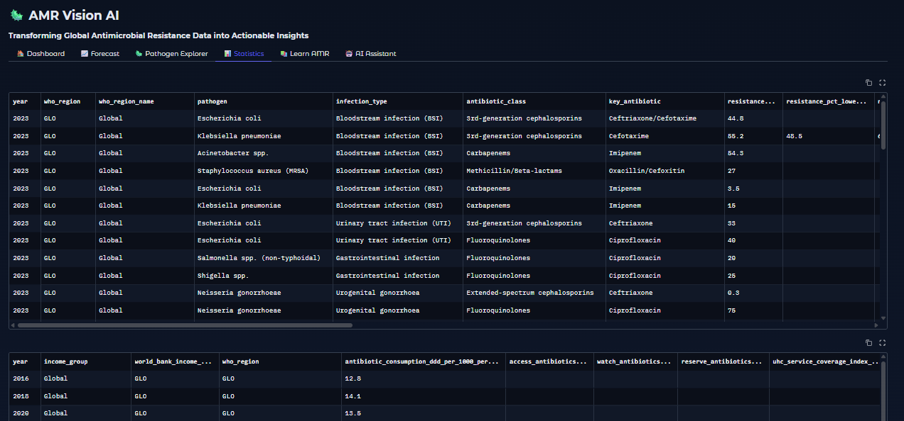
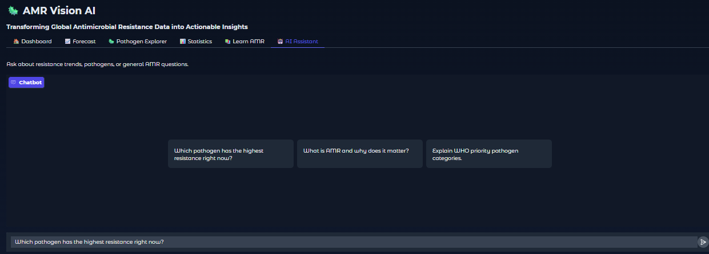

Check out the configuration reference at https://huggingface.co/docs/hub/spaces-config-reference

# 🦠 AMR Vision AI

### Transforming Global Antimicrobial Resistance Data into Actionable Insights
AMR Vision AI is an interactive web application that helps users explore and understand **Antimicrobial Resistance (AMR)** through data visualization, pathogen information, forecasts, and an AI assistant.
## ✨ Features
* 📊 **Dashboard** — Global resistance, mortality, and antibiotic consumption overview
* 📈 **Forecast** — View resistance projections for individual pathogens through 2026
* 🦠 **Pathogen Explorer** — Explore WHO priority, infections, resistance mechanisms, and antibiotics
* 📋 **Statistics** — View the underlying AMR datasets
* 📚 **Learn AMR** — Simple educational information about antimicrobial resistance
* 🤖 **AI Assistant** — Ask natural-language questions about AMR using Llama 3.3 70B

## 📂 Datasets
The application uses four datasets:
* `forecast.csv` — Resistance and forecast values
* `consumption.csv` — Antibiotic consumption and health/economic indicators
* `mortality.csv` — AMR mortality burden
* `pathogens.csv` — Pathogen reference information

## 🛠️ Technologies
* **Python**
* **Pandas** — Data processing
* **Plotly** — Interactive visualizations
* **Gradio** — Web interface
* **Groq API + Llama 3.3 70B** — AI assistant
* **Hugging Face Spaces** — Deployment

## 🚀 Run Locally
Install dependencies:
```bash
pip install -r requirements.txt
```

Run the application:
```bash
python app.py
```
The required CSV files should be placed in the same directory as `app.py`.

## 🔐 AI Assistant Setup
Set your Groq API key as an environment variable:
```text
GROQ_API_KEY=your_api_key
```
For Hugging Face Spaces, add the key as a **Secret** rather than putting it directly in the code.

## 🏗️ Project Structure
```text
AMR-Vision-AI/
│
├── app.py
├── forecast.csv
├── consumption.csv
├── mortality.csv
├── pathogens.csv
├── requirements.txt
└── README.md
```

## 🎯 Goal
The goal of AMR Vision AI is to turn complex antimicrobial resistance data into **clear, interactive, and accessible insights** that support AMR awareness and understanding.

## Web app
<p align="center">
  
</p>

<p align="center">
  
</p>

<p align="center">
  
</p>

<p align="center">
  
</p>

<p align="center">
  
</p>

<p align="center">
  
</p>

<p align="center">
  
</p>

<p align="center">
  
</p>
## 👩‍💻 Author
**Arooba Afghan**
Computer Science | AI/ML
---
> 🦠 **From Data to Awareness, From Awareness to Action.**

